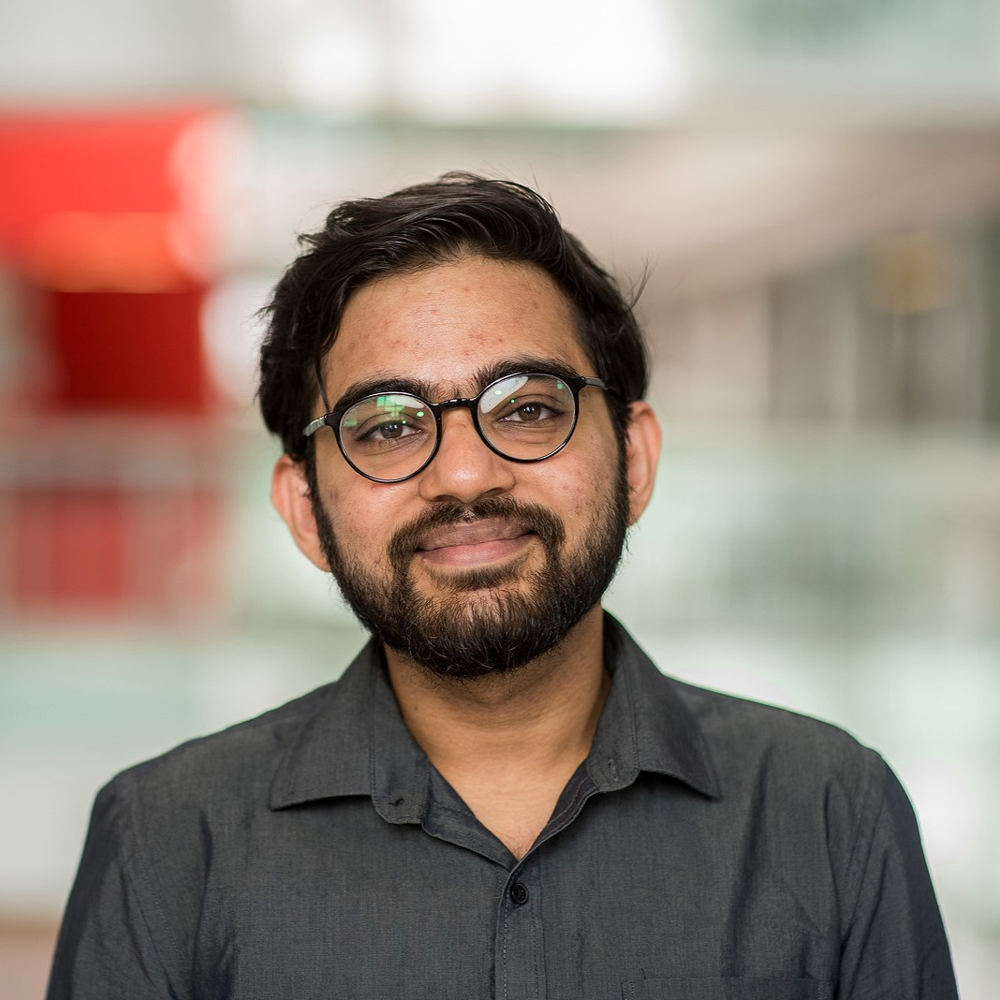

	<!-- 
 -->
    

        
    

    

        <h4>
            <!-- <strong> -->
            
                Pritam Sarkar (প্রীতম সরকার)
             
            
                Postdoc at UBC and Vector Institute
             
            
                Email: pritam.sarkar@queensu.ca
            
            <!--  
            
                sarkar[dot]pritam[dot]ai[at]gmail[dot]com
             (personal email id) -->
            <!-- </strong> -->
        </h4>
        <!--   -->
         
         
         
        <!--   -->
    

    <!-- 
 -->

I am interested in advancing safe multimodal intelligence and in designing algorithms that require minimal human supervision. Currently, I am a postdoc at the [University of British Columbia](https://www.ubc.ca/) and [Vector Institute](https://vectorinstitute.ai/), working with [Leonid Sigal](https://www.cs.ubc.ca/~lsigal/). 
I completed my PhD in 2025 at [Queen’s University](https://queensu.ca/), where I worked with [Ali Etemad](https://www.aiimlab.com/ali-etemad). During my PhD, I interned at [Google](https://research.google/) and [RBC Borealis](https://rbcborealis.com/), and was affiliated with the [Vector Institute](https://vectorinstitute.ai/), [Ingenuity Labs](https://ingenuitylabs.queensu.ca/), and [Aiim Lab](https://www.aiimlab.com/). 
I received the First Prize in the Research Excellence Award (PhD), IEEE Kingston Section, in 2023. Outside of research, I am passionate about photography and film-making, enjoy coffee, long walks, and playing a bit of badminton.

<!-- I joined Queen's in 2018 and completed my master's in 2020, and subsequently began my PhD.  -->
<!-- Prior to that, I worked for about three years as a Software Engineer at [Infosys](https://www.infosys.com/) and [Tech Mahindra](https://www.techmahindra.com/). I completed my bachelor's in 2015 from [West Bengal University of Technology, India](/).  -->
<!-- Outside of research, I am passionate about photography and film-making, enjoy coffee, and like walking, running, and playing a bit of badminton. -->

<mark class="black">
<strong>Open to collaboration</strong> 
If you are interested in collaborating on research ideas of mutual interest, 
please feel free to <a title="pritam.sarkar@queensu.ca" href="mailto:pritam.sarkar@queensu.ca" target="_blank">email</a> me. 
<!-- I am also open to speaking engagements as well. -->
</mark>

    
<strong>Pro-bono activity</strong> (click to read more)

    <ul>
        

            I am starting this initiative to dedicate 45 minutes each week to speak with graduate students who may not have access to strong mentorship networks or peers in their research areas. If you would like to brainstorm ideas, discuss your research direction, or get an external perspective on your work, I am happy to help. 
        

        

            <strong>Why am I doing this?</strong> 
            I have been fortunate to receive support from excellent mentors and peers at various stages of my career, and I also know what it feels like to work alone without any guidance. 
        

        
        

            To express your interest, please send a brief message through this
            <a href="https://forms.gle/ZJH79XhwN8dWcxS27">form</a>, and I will get back to you.
            Before reaching out, please review my research interests to see if they (at least somewhat) align with yours.
        

        

            To make the best use of our time, let us plan the discussion in the following format:
        

        <ul>
            <li>5 minutes: Quick introductions.</li>
            <li>10 minutes: You describe your research problem, current progress, and specific challenges. Ideally some slides with specific points.</li>
            <li>25 minutes: Brainstorming ideas and some actionable feedback.</li>
            <li>5 minutes: Wrap up and any final questions/suggestions for me.</li>
        </ul>

        

            Please be assured that I will periodically review the submitted responses and reach out to selected candidates. However, due to limited time, I may not be able to respond to everyone. Based on my availability, I may schedule sessions during the weekends. Thank you for your understanding. 
        

    </ul>

### [Research](./research.md)

My current research focus is **multimodal AI with video, image, audio, and language**. 

Broadly interested in: generative models (LLMs, multimodal LLMs, diffusion models), foundation models (video, image, vision-language, audio-visual), self-supervised learning, alignment, reasoning, AI agents, computer vision.
Please find more about my research [here](./research.md).

### News

- [Oct 25] I am serving as an AC for WACV 2026.
- [Sep 25] Our proposed **[Self-alignment with RRPO](https://arxiv.org/abs/2504.12083)** got accepted in **NeurIPS** 2025.
- [Sep 25] I successfully defended my PhD thesis! Here are the [slides](https://docs.google.com/presentation/d/18-uRKXQ_1tO5Gnn3FGNVkybN2cidjHqCg2_d2cD-ZZM/).
- [May 25] Introduced **[VCRBench](https://arxiv.org/abs/2505.08455)**, the first video-based multi-step causal reasoning benchmark.
- [Apr 25] Introduced **[RRPO](https://arxiv.org/abs/2504.12083)**, a fine-grained self-alignment recipe to align Multimodal LLMs.
- [Jan 25] **[DPA](https://arxiv.org/abs/2405.18654)** got accepted in **ICLR** 2025.
- [Dec 23] **[XKD](https://arxiv.org/abs/2211.13929)** and **[RDDM](https://arxiv.org/abs/2308.13568)** got accepted in **AAAI** 2024.
- [Nov 23] I have won the **first prize** in IEEE Research Excellence Award (PhD).
- [Sep 23] Our paper on **[Video SSL in OOD](https://arxiv.org/abs/2306.02014)** got accepted in **NeurIPS** 2023 as a **Spotlight**.
- [Aug 23] Accepted an offer from **Google** to join as a Student Researcher.
- [Nov 22] **[AVCAffe](https://arxiv.org/abs/2205.06887)** and **[CrissCross](https://arxiv.org/abs/2111.05329)** (**Oral**) got accepted in **AAAI** 2023.
- [Oct 22] We are organizing [AAAI 2023 Workshop on R2HCAI](https://r2hcai.github.io/AAAI-23/).
- [Oct 22] **Honourable Mention** in poster competitions (1.) Robotics and AI Symposium 2022 and (2.) FEAS Research Symposium 2022 at Queen's University, Canada.
- [Jun 22] Accepted an offer from Borealis AI for a fall internship as a Machine Learning Research Intern.
- [Oct 21] **Best poster** award at Robotics and AI Symposium, Ingenuity Labs, 2021.
- [Aug 21] We are organizing [AAAI 2022 Workshop on HC-SSL](https://hcssl.github.io/AAAI-22/).
- [Mar 21] I received postgraduate affiliation award from Vector Institute. [News](https://vectorinstitute.ai/vector-welcomes-new-researchers-to-postgraduate-affiliate-program/)
- [Dec 20] Our paper **[CardioGAN](https://arxiv.org/abs/2010.00104)** got accepted in **AAAI** 2021.

  
Click to see old news

  <ul>
  <li>[Aug 20] My first journal/transaction as a first author got accepted in IEEE Trans. of Affective Computing.</li>
  <li>[Apr 20] Successfully defended my M.A.Sc. thesis.</li>
  <li>[Jan 20] Conference paper on ECG-based SSL got accepted in IEEE ICASSP 2020 for oral presentation.</li>
  <li>[Jun 19] My first paper got accepted for oral presentation in IEEE ACII 2019.</li>
  <li>[Sep 18] Joined Queen's for a master's degree.</li>
  <li>[Dec 17] Joined Infosys as a Sr. System Engineer.</li>
  <li>[Nov 15] Joined Tech Mahindra as a Software Engineer.</li>
  <li>[Jun 15] Completed B.Tech!</li>
  </ul>

<!-- 
 -->

### Education

- **PhD** at Queen's University, Canada, 2020 - 2025. [PhD Thesis](https://qspace.library.queensu.ca/items/e35f85c6-3a6b-49b7-ade1-70fdcf3bcd2a). [Convocation Video](https://youtube.com/clip/UgkxnPWuCeGlN-Mf0vPgx4MAUg5u1b7sEnm4?si=J9t5nAfb9gADi-Yr).
- **MASc** at Queen's University, Canada, 2018 - 2020. [MASc Thesis](https://qspace.library.queensu.ca/items/d3599bb3-56dd-4c65-bac6-8b4de0e36927).
- **B.Tech** at West Bengal University of Technology, India, 2011 - 2015.

### Employment

- Postdoctoral Research Fellow at **University of British Columbia**, Vancouver, Canada 2025 - Present.
- Distinguished Postdoctoral Fellow at **Vector Institute**, Toronto, Canada, 2025 - Present.
- Research Assistant at **Queen's University**, Kingston, Canada, 2018 - 2025.
- Teaching Assistant/Guest Lecturer at **Queen's University**, Kingston, Canada, 2018 - 2025.
- Student Researcher at **Google**, Sunnyvale, USA, Fall 2023.
- Machine Learning Research Intern at **RBC Borealis**, Toronto, Canada, Fall 2022.
- Sr. System Engineer at **Infosys** Ltd., Bangalore, India, 2017 - 2018.
- Software Engineer at **Tech Mahindra** Ltd., Hyderabad, India, 2015 - 2017.

### Academic Service

I serve as an **AC** for the following:
- WACV 2026

I frequently **review** for the following venues:
- NeurIPS (2023, 2025), ICLR (2024, 2025), ICML (2024)
- CVPR (2023, 2024, 2026), ICCV (2023), ECCV (2022, 2024) 
- PAMI (2023 - Present), T-Affc (2022 - Present)

### Invited Talks

There are some overlaps across my recent talks which are derived from my PhD thesis, so I am sharing the slides from my PhD defence, which provide a high-level overview combining most of my recent content. [Link](https://docs.google.com/presentation/d/18-uRKXQ_1tO5Gnn3FGNVkybN2cidjHqCg2_d2cD-ZZM/edit?usp=sharing)

- [Nov 2025] MLRG at University of Guelph, *Advacing Safe Multimodal Intelligence*
- [Oct 2025] Vector Institute, *Advacing Safe Multimodal Intelligence*
- [Jul 2025] Amazon AGI, *Multimodal Learning from Videos: Pre-training, Post-training, and Benchmarks*
- [Jul 2025] MLR at Apple, *Multimodal Learning from Videos: Pre-training, Post-training, and Benchmarks*
- [May 2025] Google Deepmind, *Multimodal Learning from Videos: Pre-training, Post-training, and Benchmarks*
- [Dec 2024] FAIR at Meta, *Multimodal Visual Understanding*
- [Jun 2024] CAIR at Google, *Mitigating Vision-Language Hallucinations via Phrase-level Alignment*
- [Jul 2023] Ingenuity Labs at Queen's University, *Learning withour human supervision* 
- [Feb 2023] AAAI, *Self-supervised Audio-Visual Representation Learning with Relaxed Cross-Modal Synchronicity* 
- [Jan 2023] Borealis AI, *AugESeq: Augmentation improves Event Sequence prediction* 
- [Sep 2019] ACII, *Classification of Cognitive Load and Expertise for Adaptive Simulation using Deep Multitask Learning* 

**Some recorded talks/videos:**

<!-- - TODO: neurips 2025 -->
- [XKD at AAAI 2024](https://underline.io/lecture/67724-self-supervised-audio-visual-representation-learning-with-relaxed-cross-modal-synchronicity)
- [Video SSL under dist shifts at NeurIPS 2023](https://slideslive.com/39009562)
- [CrissCross at AAAI 2023](https://underline.io/lecture/67724-self-supervised-audio-visual-representation-learning-with-relaxed-cross-modal-synchronicity)
- [AVCAffe at AAAI 2023](https://underline.io/lecture/68899-avcaffe-a-large-scale-audio-visual-dataset-of-cognitive-load-and-affect-for-remote-work)
- [CardioGAN at AAAI 2021](https://underline.io/lecture/73382-cardiogan-attentive-generative-adversarial-network-with-dual-discriminators-for-synthesis-of-ecg-from-ppg)